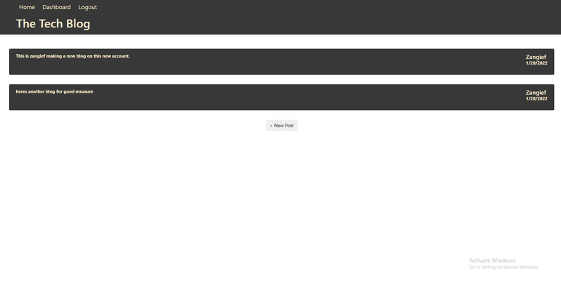

# MVC CMS-style blog site
https://wingz003.github.io/TechBlog-de-Luigi/

# Description
This is a CMS-style blog site that publishes and edits blog posts as well as making comments on other blog posts.
This comes with full blog editing, login and signup capabilities as well as using session storage to personalize your own profile.

# Table of Contents
* [Installation](#installation)
* [Usage](#usage)
* [Contributions](#contributions)
* [Questions](#questions)

## Installation
### You will need to install the following dependencies prior to running the application: 

Bcrypt, connect-session-sequelize, dotenv, express-handlebars, express-session, mysql2 and sequelize.

## Usage 
### Below are the following steps required to run this application: 

1. When application is deployed, you will be directed to the homepage where you wont be able to access the dashboard or make any comments on existing blogs unless youre logged in.

2. Whenever you decide on loggin in, you will be presented with a form to insert your credentials to login.

3. After logging in, you will be directed to your own personal dashboard in which you can ADD, UPDATE and DELETE your blogs to your hearts content.

4. You are also able to add comments to other existing blogs once youre logged in.

5. You also have the option to sign up a new account. There is a link in the login window that allows you to sign up instead.

6. After signing up on your new account, then you are redirected to your dashboard where you can start making and editing your own blogs as a new user.

## Contributions 

No contributions have been made.

## Questions
### If you have a questions or concerns, feel free to contact me at Lsanti618@gmail.com.
